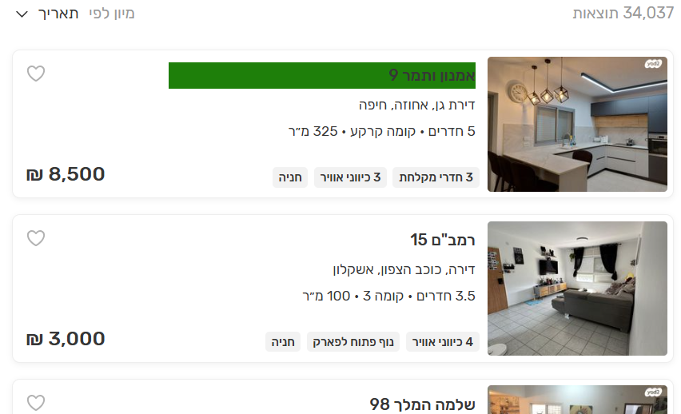
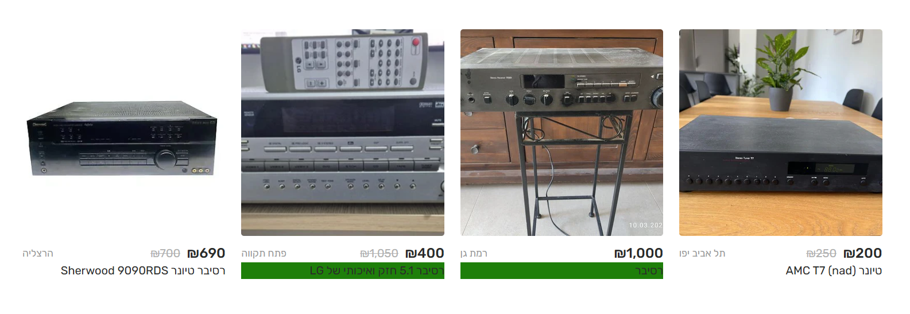

# Yadi2

Web extension to mark new Yad2 listings.

## Demo

</img> ... 
</img>

</img>

</img>

## Features
- [x] Mark new listings (you chosse from how many days).
- [x] Ignore listings without a price tag. 
- [x] Nadlan - Ignore listings by agencies (מתווכים).

## Usage

### First Deploy:

Clone this repo.  
Chromium-based browser -> Extensions settings -> Load Unpacked -> Choose Yadi2 folder.


## Misc

### Build It Yourself

#### Pre-install Dependencies

``` sh
npm install --save-dev webpack webpack-cli
npm install --save-dev babel-loader @babel/core @babel/preset-env
```

#### Compile

``` sh
npx webpack --config webpack.config.js
```

## Bugs

Yad2 developers occasionally change their front-end, including HTML class names, which can brake this extension.  
To fix this, update the relevant HTML class names in "src/consts.js".  
PRs are welcome.

### Licence

MIT.